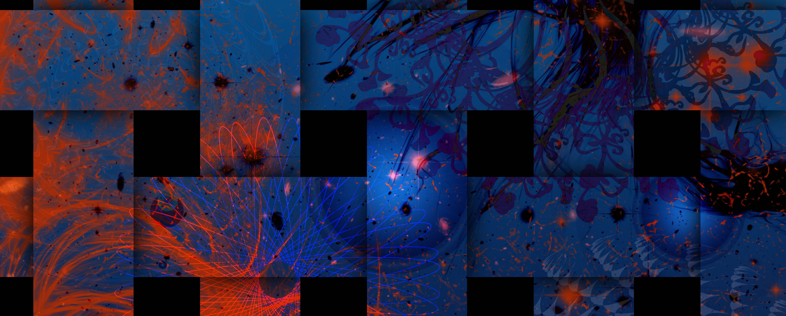

# Personal Site for Aleia Knight

  

---

## Motivation
This is a site of 2 parts:

One is to showcase different works, projects, ideas, etc. of Aleia Knights'.

Secondly, to actively practice and display a full-stack web development skillset.

---

## Live Site
[aleiaknight.com](http://aleiaknight.com)

---

## Built With
* Python 3
* Django
* HTML
* CSS
* SQLLite
* NASA APOD API
* Bootstrap

---

## CREDITS:

TITLE: 
Marble - Fully Responsive Free HTML5 template

AUTHOR:
DESIGNED & DEVELOPED by FREEHTML5.co

Website: http://freehtml5.co/
Twitter: http://twitter.com/fh5co
Facebook: http://facebook.com/fh5co

Bootstrap
http://getbootstrap.com/

jQuery
http://jquery.com/

jQuery Easing
http://gsgd.co.uk/sandbox/jquery/easing/

Modernizr
http://modernizr.com/

Google Fonts
https://www.google.com/fonts/

Icomoon
https://icomoon.io/app/

Respond JS
https://github.com/scottjehl/Respond/blob/master/LICENSE-MIT

animate.css
http://daneden.me/animate

jQuery Waypoints
https://github.com/imakewebthings/waypoints/blog/master/licenses.txt

Demo Images:
http://pexels.com

Owl Carousel
http://www.owlcarousel.owlgraphic.com/

Stellar Parallax
http://markdalgleish.com/projects/stellar.js/

jQuery counTo
https://github.com/mhuggins/jquery-countTo

Google Map
https://maps.google.com/

